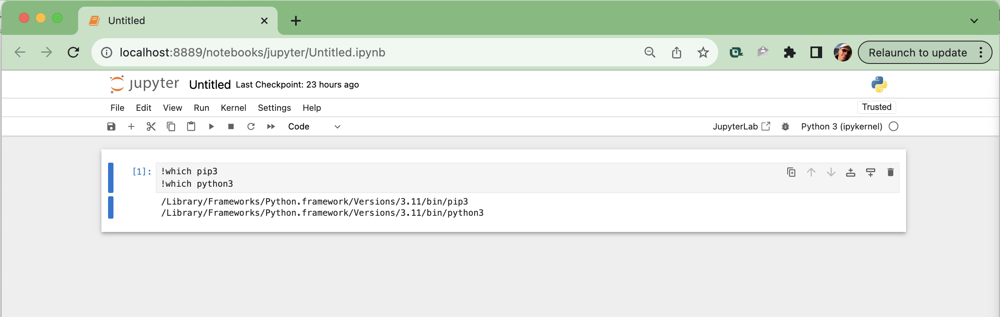
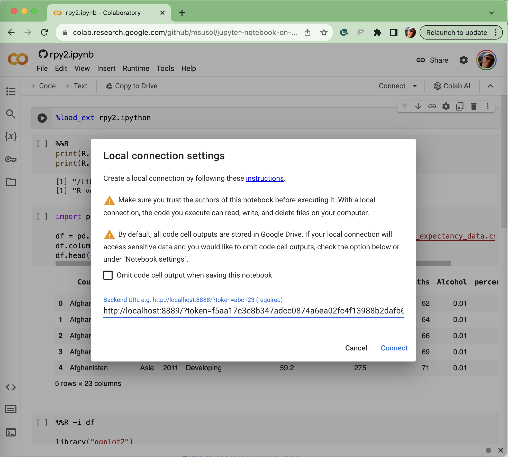
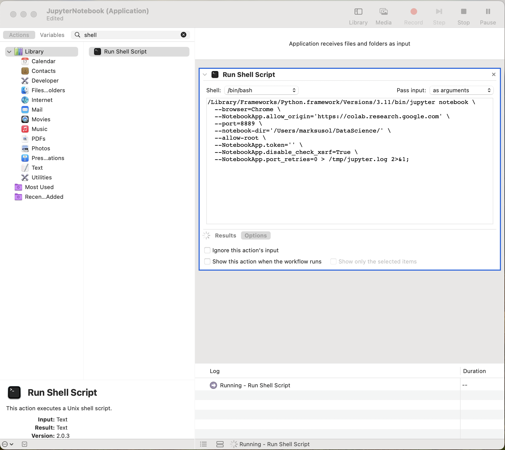
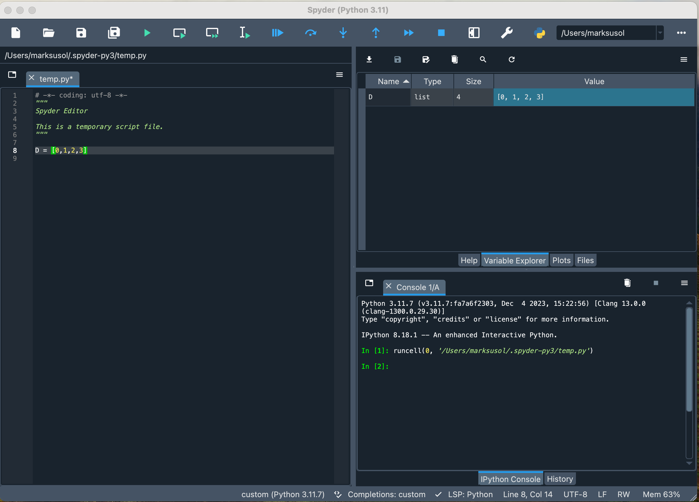
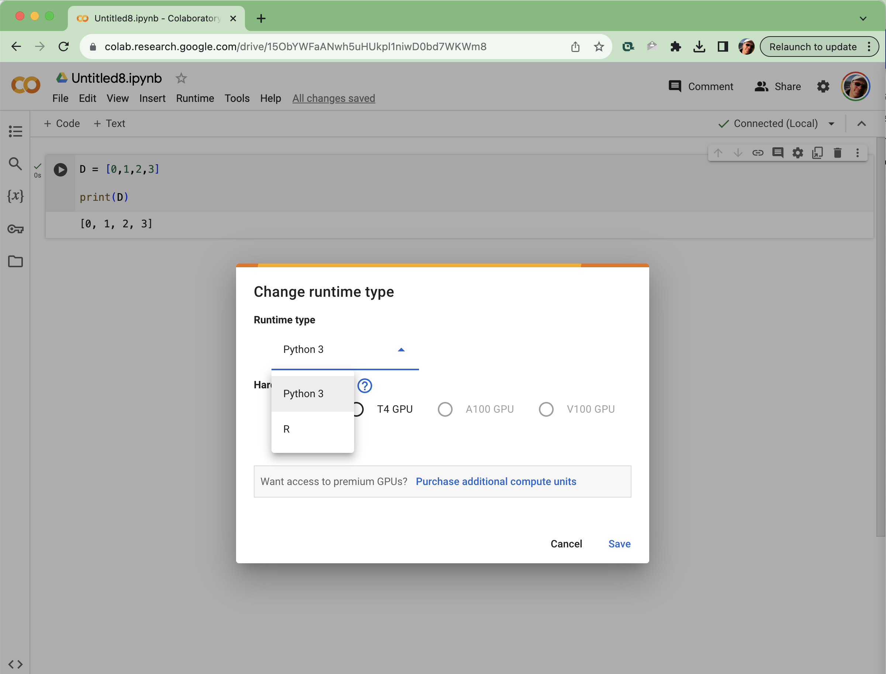
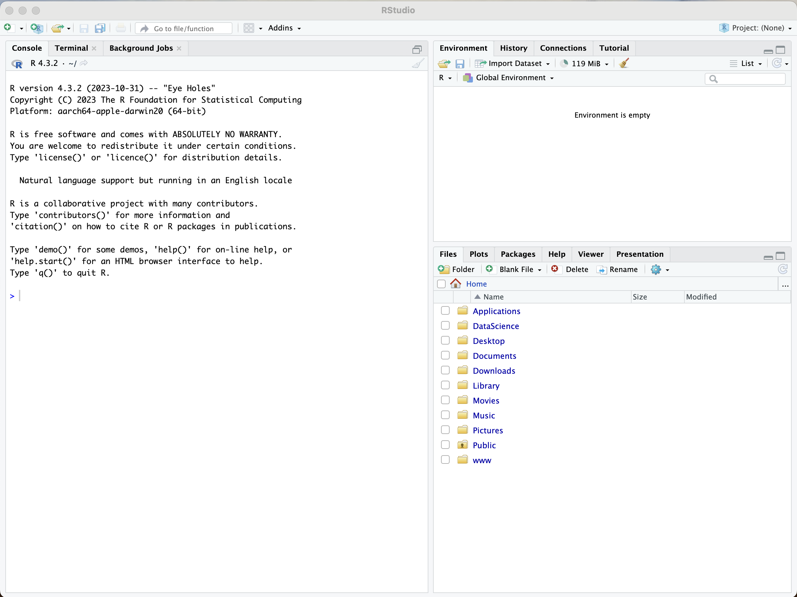
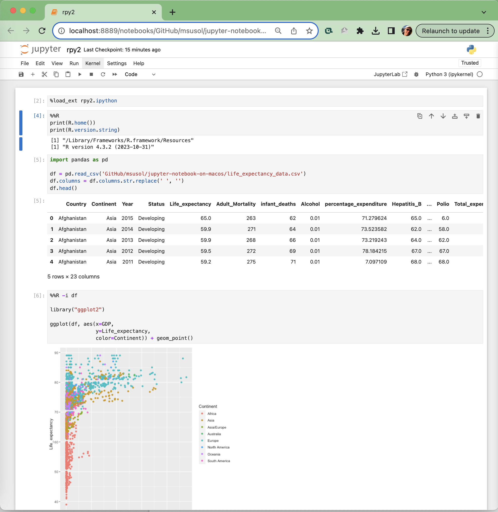

# Jupyter Notebook on MacBook Pro

Having had to repeat the process of firing up a new python dev station on a new
Macbook Pro, thought I'd put the instructions out there for others to follow.

> **NOTE:** Implemented on fresh MacBook Pro (Apple M3 Pro) on Sonoma 14.2.

## Python on macOS

My approach to setting up a Macbook Pro for data science using Python involves
installing Python-dot-org Pythons, and using `pip` to install any packages I
may need. While this makes Python 3.11 available globally, it won't 
touch the core Python installation that is used by the MacOS.

Over the years, I have tried to use installation methods involving `macports`, 
`conda`, and `brew`. I found it all a bit cumbersome, and each time I would 
attempt to follow past instructions I had saved for myself, I wasn't successful. 
Also given I use IntelliJ to test GitHub projects across multiple Python 3.x 
versions, this approach just works better as I can have 3.7, 3.8, ..., 3.12 
Python-dot-org Pythons installed.

As well, there have been very few situations in the last decade where I 
really felt the need to set up two separate python environments, e.g., 
TensorFlow 1.x vs TensorFlow 2.x. So I will only set up virtual environments 
as needed (See
[Creating Virtual Environments](https://packaging.python.org/en/latest/tutorials/installing-packages/#creating-virtual-environments))

### Install Python

Download the latest desired version of Python
3.xx and run the package installer:
[Python 3.11.7](https://www.python.org/downloads/release/python-3117/)

You should now have `python3` alias pointing at the installed 3.xx python
binaries:

```shell
% which python3
/Library/Frameworks/Python.framework/Versions/3.11/bin/python3

% python3
Python 3.11.7 (v3.11.7:fa7a6f2303, Dec  4 2023, 15:22:56) [Clang 13.0.0 (clang-1300.0.29.30)] on darwin
Type "help", "copyright", "credits" or "license" for more information.
>>>
```

You may need to install a set of current SSL root certificates after the
python installation process (did I miss this in the package installer
process?). I came across this error when running the
[rpy2 demo](#r-and-python-rpy2) on Colab below.

```shell
% /Applications/Python\ 3.11/Install\ Certificates.command ; exit;
```

#### Upgrade Pip

Almost always is the case that you will need to upgrade pip after installing 
python, so do this by default now.

```shell
% pip3 install -U pip

% pip3 list | grep "pip"
Package                       Version
----------------------------- ----------   
pip                           23.3.1
```

Ensure at this point that you find the following:

```shell
% which pip3
% which python3

/Library/Frameworks/Python.framework/Versions/3.11/bin/pip3
/Library/Frameworks/Python.framework/Versions/3.11/bin/python3
```

> **NOTE:** We will be using `pip3` anywhere we mention using `pip`.

#### Upgrade Python

When it comes time to upgrade Python-dot-org Pythons, consider using
[pymac](https://discuss.python.org/t/pymac-command-line-tool-to-install-and-manage-python-org-mac-installations/14742)
which allows you to upgrade to the micro versions, i.e. 3.11.7 to 3.11.8.
I'll update this document when 3.11.8 is actually released, if at all.

### Jupyter Notebook

Installing Jupyter is a pretty simple process, just use `pip` to install, 
and launch directly:

```shell
% pip3 install -U jupyter

% jupyter notebook
```

We can customize the notebook config to use a specific directory, and even 
set which port we intend to launch Jupyter on. Use the following command to 
launch Jupyter now:

```shell
% jupyter notebook \
  --NotebookApp.allow_origin='*' \
  --port=8889 \
  --notebook-dir='/Users/marksusol/DataScience/' \
  --allow-root \
  --NotebookApp.token='' \
  --NotebookApp.disable_check_xsrf=True \
  --NotebookApp.port_retries=0 > /tmp/jupyter.log 2>&1
```

> **NOTE:** I purposely chose to use a non-default `port=8889` as often another 
> process will try to use `port=8888`, so I avoid the port collision this way.

In the event, you close the Terminal window from which you launched Jupyter 
and need to shut it down, you will need to find the process ID for the job 
and kill it directly.

```shell
% lsof -t -i:8889 | xargs kill -9
```

Create a new notebook in Jupyter, and in a code block ensure that Jupyter is in fact running off our Python-dot-org Python as
we see in shell.



You will now be able to directly use `pip` in Jupyter to update packages as 
needed. See the example code block to install missing `tensorflow` package 
directly from a notebook.

```shell
!pip3 install -U tensorflow
```

### Colab Notebook

Google's Colab will let you connect to a local runtime. This allows you to 
execute code on your local hardware using the Colab UI at
[colab.research.google.com](https://colab.research.google.com).

```shell
% jupyter notebook \
  --NotebookApp.allow_origin='https://colab.research.google.com' \
  --port=8889 \
  --notebook-dir='/Users/marksusol/DataScience/' \
  --allow-root \
  --NotebookApp.token='' \
  --NotebookApp.disable_check_xsrf=True \
  --NotebookApp.port_retries=0 > /tmp/jupyter.log 2>&1
```

Now open [colab.research.google.com](https://colab.research.google.com/) and
connect to our local runtime.



> **_WARNING:_** Make sure you trust the authors of any notebook before
> executing it. With a local connection, the code you
> execute can read, write, and delete files on your computer.
>

### Launch Script

In order to make our lives easier when launching Jupyter, let's create a shell 
script to run the `jupyter notebook` command with all the desired flags above.

Create [jupyter_notebook.sh](jupyter_notebook.sh) as follows:

```bash
#!/bin/zsh

jupyter notebook \
  --NotebookApp.allow_origin='https://colab.research.google.com' \
  --port=8889 \
  --notebook-dir='/Users/marksusol/DataScience/' \
  --allow-root \
  --NotebookApp.token='' \
  --NotebookApp.disable_check_xsrf=True \
  --NotebookApp.port_retries=0 > /tmp/jupyter.log 2>&1;
```

Now, in your terminal of choice run the shell command as follows:

```shell
% sh jupyter_notebook.sh
```

### Automator (WIP)

You can automate the running of this shell command using Apple's Automator.



> **TODO:** Figure out how to have Apple's Automator launch a shell scrip but
> not use the Xtools paths for pip3/python3. See below how Jupyter is not 
> correctly connected.
>
> ```shell
> ! which pip3
> ! which python3
>
> /usr/bin/pip3
> /usr/bin/python3
>
> !pip3 -V 
> !python3 -V
>
> pip 21.2.4 from /Library/Developer/CommandLineTools/Library/Frameworks/Python3.framework/Versions/3.9/lib/python3.9/site-packages/pip (python 3.9)
> Python 3.9.6
> ```

### Spyder IDE

The Scientific Python Development Environment | Spyder-IDE.org

Install the IDE and open from terminal:

```shell
% pip3 install -U spyder
% pip3 install -U spyder-notebook

% spyder
```

The Spyder app will run but be title 'Python' instead.



> **NOTE:** If you were to install Spyder from the `Spyder.dmg` file on the
> site, it will install python 3.7. If you were
> to try and point to our newly installed python 3.11 interpreter, it will give
> you errors like:
>
> `incompatible architecture (have 'arm64', need 'x86_64')`

## R on macOS

### Install R

Download and run the appropriate package installer for `R` from
[CRAN](http://cran.us.r-project.org/).

> For Apple Silicon (M1/M2/M3)
> Macs: [R-4.3.2-arm64.pkg](https://lib.stat.cmu.edu/R/CRAN/bin/macosx/big-sur-arm64/base/R-4.3.2-arm64.pkg)

### Jupyter Notebook (R)

Run the code below from the command line to install the `IRkernel` for 
Jupyter. It starts up R, installs the adapter between Jupyter and R (a kernel), and then exits.

```shell
% R -e "install.packages('IRkernel', repos = 'http://cran.us.r-project.org');IRkernel::installspec()"
```

Now when you open Jupyter you can create new R notebooks, and even switch 
between kernels!

```shell
% jupyter kernelspec list 
...
Available kernels:
  ir         /Users/marksusol/Library/Jupyter/kernels/ir
  python3    /Library/Frameworks/Python.framework/Versions/3.11/share/jupyter/kernels/python3
```

### Colab Notebook (R)

Google's Colab will also now pick up on the different local kernels 
available when you connect to your local runtime. So you can build python 
and/or colab notebooks for datascience projects in your drive account.



### RStudio IDE

Download and run the appropriate desktop package installer for 
[RStudio](https://posit.co/download/rstudio-desktop/).

> For MacOS 12 and higher: [RStudio-2023.09.1-494.dmg](https://download1.rstudio.org/electron/macos/RStudio-2023.09.1-494.dmg)



## R and Python - Double BAM!

While python is becoming one of the primary languages of data scientist, 
`R` is still the statistical preference we often need to run with. But often 
we are faced with having had developed a lot of code in python that we would 
prefer to run, i.e., data mining. So how can we pass the resulting ETL to an 
`R` package?

Install the `rpy2` package, which allows Python to talk to R. You can use
pip to install it:

```shell
% pip3 install -U rpy2
```

Each time you start a new notebook you'll need to load `rpy2` as an extension:

```
%load_ext rpy2.ipython
```

And then you can run `R` code alongside python and share pandas dataframes, as
long as you put `%%R` magic in the top of the cell.

```
%%R
R.version.string

[1] "R version 4.3.2 (2023-10-31)"
```



> **NOTE:** You may need to set the environmental variable `R_HOME` in a python
> code block once before running the `rpy2` colab.
>
>```python
>import os
>
>os.environ['R_HOME'] = '/Library/Frameworks/R.framework/Resources'
>```
>

Try
the [rpy2 on Colab notebook](https://colab.research.google.com/github/msusol/jupyter-notebook-on-macos/blob/main/rpy2.ipynb)
for yourself.

## References

1. [Top programming languages for data scientists in 2023](https://www.datacamp.com/blog/top-programming-languages-for-data-scientists-in-2022)
1. [Double BAM! StatQuest with Josh Starmer](https://www.youtube.com/@statquest)
1. [Python: Creating Virtual Environments](https://packaging.python.org/en/latest/tutorials/installing-packages/#creating-virtual-environments)
1. [Pymac: Command line tool to install and manage Python.org Mac 
   installations](https://discuss.python.org/t/pymac-command-line-tool-to-install-and-manage-python-org-mac-installations/14742)
1. [Everything I Know: R with Python and Jupyter Notebook](https://jonathansoma.com/everything/setup/use-r-python-jupyter/)
1. Source
   of [life_expectancy_data.csv](https://gist.github.com/aishwarya8615/89d9f36fc014dea62487f7347864d16a#file-life_expectancy_data-csv)