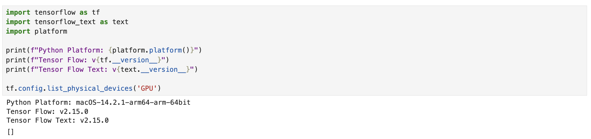
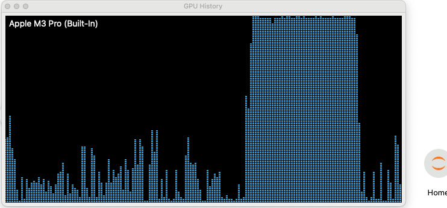
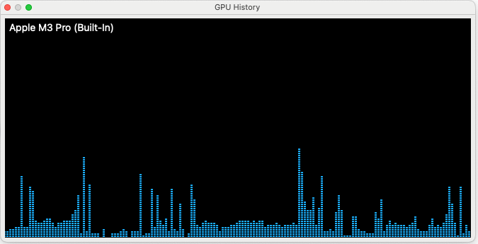

# TensorFlow on Apple M3 Pro

https://www.tensorflow.org/install/source#macos
https://www.tensorflow.org/install/pip

Guidance:
- https://medium.com/@murphy.crosby/building-tensorflow-and-tensorflow-text-on-a-m1-mac-9b90d55e92df
  - https://gist.github.com/TeoZosa/da88a858ad73a18e3f7410c4b615466d


| Version           | Python   | Compiler                   | Build tools |
|-------------------|----------|----------------------------|-------------|
| tensorflow-2.16.1 | 3.9-3.12 | Clang 17.0.6 (xcode 13.6)  | Bazel 6.5.0 |
| tensorflow-2.15.0 | 3.9-3.11 | Clang 16.0.0 (xcode 10.15) | Bazel 6.1.0 |

PROBLEM TO SOLVE

similar to https://github.com/tensorflow/text/issues/823

```zsh
ERROR: Could not find a version that satisfies the requirement tensorflow_text (from versions: none)
ERROR: No matching distribution found for tensorflow_text
```

## Xcode v15.1

```zsh
% /usr/bin/xcodebuild -version
xcode-select: error: tool 'xcodebuild' requires Xcode, but active developer directory '/Library/Developer/CommandLineTools' is a command line tools instance

% pkgutil --pkg-info=com.apple.pkg.CLTools_Executables | grep version
version: 15.1.0.0.1.1700200546
```

Download Xcode v15 from [App Store](https://apps.apple.com/us/app/xcode/id497799835?mt=12)

```zsh
 % /usr/bin/xcodebuild -version                                       
Xcode 15.1
Build version 15C65

% xcrun -f ld                                                        
/Applications/Xcode.app/Contents/Developer/Toolchains/XcodeDefault.xctoolchain/usr/bin/ld

% ld -v
@(#)PROGRAM:ld  PROJECT:dyld-1022.1
BUILD 13:21:42 Nov 10 2023
configured to support archs: armv6 armv7 armv7s arm64 arm64e arm64_32 i386 x86_64 x86_64h
will use ld-classic for: armv6 armv7 armv7s arm64_32 i386 armv6m armv7k armv7m armv7em
LTO support using: LLVM version 15.0.0 (static support for 29, runtime is 29)
TAPI support using: Apple TAPI version 15.0.0 (tapi-1500.0.12.8)
Library search paths:
Framework search paths:
```
^ LLVM version 15.0.0 

## Clang v16.0

https://www.tensorflow.org/install/source#install_clang_recommended_linux_only

Clang is a C/C++/Objective-C compiler that is compiled in C++ based on LLVM. It
is the default compiler to build TensorFlow starting with TensorFlow 2.13. The
current supported version is **LLVM/Clang 16**.

```zsh
% /usr/bin/clang -v
Apple clang version 15.0.0 (clang-1500.1.0.2.5)
Target: arm64-apple-darwin23.2.0
Thread model: posix
InstalledDir: /Applications/Xcode.app/Contents/Developer/Toolchains/XcodeDefault.xctoolchain/usr/bin
```

Macports
https://www.macports.org/

```zsh
~ % source ~/.zprofile # Macports already added PATH
~ % sudo port install clang-16
~ % port contents clang-16

~ % /opt/local/bin/clang-mp-16 -v
clang version 16.0.6
Target: arm64-apple-darwin23.2.0
Thread model: posix
InstalledDir: /opt/local/libexec/llvm-16/bin
```


```zsh
~ % echo "" >> ~/.zprofile
~ % echo "# Clang (v16.0) for Tensorflow v2.15" >> ~/.zprofile
~ % echo "PATH=\"/opt/local/libexec/llvm-16/bin:\${PATH}\"" >> ~/.zprofile
~ % echo "export PATH" >> ~/.zprofile
~ % source ~/.zprofile
```

and now

```zsh
~ % clang -v
clang version 16.0.6
Target: arm64-apple-darwin23.2.0
Thread model: posix
InstalledDir: /opt/local/libexec/llvm-16/bin
```

## Bazel v6.1.0

The project you're trying to build requires **Bazel 6.1.0**.

Make sure to install the correct Bazel version from TensorFlow's 
**[.bazelversion]((https://github.com/tensorflow/tensorflow/blob/master/.bazelversion)**) file.

https://bazel.build/install/bazelisk#install-with-installer-mac-os-x

```zsh
~ % export BAZEL_VERSION=6.1.0
~ % curl -fLO "https://github.com/bazelbuild/bazel/releases/download/$BAZEL_VERSION/bazel-$BAZEL_VERSION-installer-darwin-arm64.sh"
~ % chmod +x "bazel-$BAZEL_VERSION-installer-darwin-arm64.sh"
~ % ./bazel-$BAZEL_VERSION-installer-darwin-arm64.sh --user
...
Bazel is now installed!

Make sure you have "/Users/marksusol/bin" in your path.
```

Let's add the Bazel PATH to our `~/.zprofile` file.

```zsh
~ % echo "" >> ~/.zprofile
~ % echo "# Bazel (user)" >> ~/.zprofile
~ % echo "PATH=\"/Users/marksusol/bin:\${PATH}\"" >> ~/.zprofile
~ % echo "export PATH" >> ~/.zprofile
~ % echo "export MACOSX_DEPLOYMENT_TARGET=14.2 " >> ~/.zprofile
~ % source ~/.zprofile
```

You can confirm Bazel is installed successfully by running the following command:

```zsh
~ % bazel --version
bazel 6.1.0
```

## Building TensorFlow 


```zsh
~ % pip --version
pip 23.3.2 from /Library/Frameworks/Python.framework/Versions/3.11/lib/python3.11/site-packages/pip (python 3.11)
```

### TensorFlow v2.15.0

https://github.com/tensorflow/tensorflow/tree/r2.15

To set TensorFlow's Python version, add to `~/.zprofile`:

```zsh
~ % echo "" >> ~/.zprofile
~ % echo "# Setting Tensorflow python version" >> ~/.zprofile
~ % echo "export TF_PYTHON_VERSION=3.11" >> ~/.zprofile
~ % source ~/.zprofile
```

Now let's clone the TensorFlow repository into our local directory used for git clones.

```zsh
~ % cd /DataScience/GitHub
GitHub % git clone --branch v2.15.0 https://github.com/tensorflow/tensorflow.git
GitHub % cd tensorflow
tensorflow % which python3        
/Library/Frameworks/Python.framework/Versions/3.11/bin/python3

tensorflow % python3 -m venv .venv
tensorflow % source .venv/bin/activate
(.venv) tensorflow % pip install --upgrade pip
(.venv) tensorflow % pip3 install numpy==1.26.2 wheel==0.42.0 packaging==23.2 requests==2.31.0 opt-einsum==3.3.0 keras==2.15
(.venv) tensorflow % pip3 install Keras-Preprocessing==1.1.2 --no-deps
(.venv) tensorflow % ./configure

You have bazel 6.1.0 installed.
Please specify the location of python. [Default is /Users/marksusol/DataScience/GitHub/tensorflow/.venv/bin/python3]: /Users/marksusol/DataScience/GitHub/tensorflow/.venv/bin/python3 


Found possible Python library paths:
  /Users/marksusol/DataScience/GitHub/tensorflow/.venv/lib/python3.11/site-packages
Please input the desired Python library path to use.  Default is [/Users/marksusol/DataScience/GitHub/tensorflow/.venv/lib/python3.11/site-packages]
/Users/marksusol/DataScience/GitHub/tensorflow/.venv/lib/python3.11/site-packages
Do you wish to build TensorFlow with ROCm support? [y/N]: N
No ROCm support will be enabled for TensorFlow.

Do you wish to build TensorFlow with CUDA support? [y/N]: N
No CUDA support will be enabled for TensorFlow.

Please specify optimization flags to use during compilation when bazel option "--config=opt" is specified [Default is -Wno-sign-compare]: -Wno-sign-compare

Would you like to interactively configure ./WORKSPACE for Android builds? [y/N]: N
Not configuring the WORKSPACE for Android builds.

Do you wish to build TensorFlow with iOS support? [y/N]: N
No iOS support will be enabled for TensorFlow.

Preconfigured Bazel build configs. You can use any of the below by adding "--config=<>" to your build command. See .bazelrc for more details.
        --config=mkl            # Build with MKL support.
        --config=mkl_aarch64    # Build with oneDNN and Compute Library for the Arm Architecture (ACL).
        --config=monolithic     # Config for mostly static monolithic build.
        --config=numa           # Build with NUMA support.
        --config=dynamic_kernels        # (Experimental) Build kernels into separate shared objects.
        --config=v1             # Build with TensorFlow 1 API instead of TF 2 API.
Preconfigured Bazel build configs to DISABLE default on features:
        --config=nogcp          # Disable GCP support.
        --config=nonccl         # Disable NVIDIA NCCL support.
Configuration finished
```

Now lets '`bazel build`' ..

```zsh
(.venv) tensorflow % bazel build -c opt --config=macos_arm64 \
  --macos_minimum_os="${MACOSX_DEPLOYMENT_TARGET}" //tensorflow/tools/pip_package:build_pip_package

...
INFO: Found applicable config definition build:macos_arm64 in file /Users/marksusol/DataScience/GitHub/tensorflow/.bazelrc: --cpu=darwin_arm64 --macos_minimum_os=11.0
...
Target //tensorflow/tools/pip_package:build_pip_package up-to-date:
  bazel-bin/tensorflow/tools/pip_package/build_pip_package
INFO: Elapsed time: 5059.060s, Critical Path: 538.10s
INFO: 22267 processes: 5077 internal, 17190 local.
INFO: Build completed successfully, 22267 total actions

(.venv) tensorflow % ./bazel-bin/tensorflow/tools/pip_package/build_pip_package /tmp/tensorflow_pkg

(.venv) tensorflow % ls /tmp/tensorflow_pkg
tensorflow-2.15.0-cp311-cp311-macosx_14_0_arm64.whl

(.venv) tensorflow % deactivate
```

### TensorFlow I/O v0.34.0

```zsh
GitHub % git clone --branch v0.34.0 https://github.com/tensorflow/io.git
GitHub % cd io
io % python3 -m venv .venv
io % source .venv/bin/activate
(.venv) io % pip install --upgrade pip
(.venv) io % pip3 install setuptools==65.5.0 wheel==0.42.0
(.venv) io % python3 setup.py -q bdist_wheel --project tensorflow_io_gcs_filesystem
(.venv) io % ls -l dist                                                                        

-rw-r--r--@ 1 marksusol  staff  12908 Jan  9 09:51 tensorflow_io_gcs_filesystem-0.34.0-cp311-cp311-macosx_14_0_universal2.whl

(.venv) io % deactivate
```

### TensorFlow Text v2.15.0

Copy the tensorflow and tensorflow-io wheels into this directory. Install 
tensorflow-io **first**, then tensorflow.

```zsh
GitHub % git clone --branch v2.15.0 https://github.com/tensorflow/text.git
GitHub % cd text
text % python3 -m venv .venv
text % source .venv/bin/activate
(.venv) text % pip install --upgrade pip
(.venv) text % pip3 install setuptools==65.5.0 wheel==0.42.0

(.venv) text % cp ../io/dist/tensorflow_io_gcs_filesystem-0.34.0-cp311-cp311-macosx_14_0_universal2.whl \
  tensorflow_io_gcs_filesystem-0.34.0-cp311-cp311-macosx_14_0_universal2.whl
(.venv) text % cp /tmp/tensorflow_pkg/tensorflow-2.15.0-cp311-cp311-macosx_14_0_arm64.whl \
  tensorflow-2.15.0-cp311-cp311-macosx_14_0_arm64.whl
  
(.venv) text % pip3 install tensorflow_io_gcs_filesystem-0.34.0-cp311-cp311-macosx_14_0_universal2.whl
(.venv) text % pip3 install tensorflow-2.15.0-cp311-cp311-macosx_14_0_arm64.whl

(.venv) text % pip3 list | grep tensorflow

tensorflow                   2.15.0
tensorflow-estimator         2.15.0
tensorflow-io-gcs-filesystem 0.34.0
```

Next you need to edit `./oss_scripts/run_build.sh` and add the `bazel` flags: 

doesn't work?

```zsh
# Build the pip package.
bazel build -c opt --config=macos_arm64 --enable_runfiles \
  --macos_minimum_os="${MACOSX_DEPLOYMENT_TARGET}" oss_scripts/pip_package:build_pip_package
```

and now ...

```zsh
(.venv) text % ./oss_scripts/run_build.sh
(.venv) text % pip3 install tensorflow_text-2.15.0-cp311-cp311-macosx_11_0_arm64.whl
(.venv) text % pip list | grep tensorflow

tensorflow                   2.15.0
tensorflow-estimator         2.15.0
tensorflow-hub               0.15.0
tensorflow-io-gcs-filesystem 0.34.0
tensorflow-macos             2.15.0
tensorflow-text              2.15.0
```

copy over for saving in repository

```zsh
(.venv) text % cp tensorflow_io_gcs_filesystem-0.34.0-cp311-cp311-macosx_14_0_universal2.whl \
  ../msusol/jupyter-notebook-on-macos/dist/tensorflow_io_gcs_filesystem-0.34.0-cp311-cp311-macosx_14_0_universal2.whl
(.venv) text % cp tensorflow-2.15.0-cp311-cp311-macosx_14_0_arm64.whl \
  ../msusol/jupyter-notebook-on-macos/dist/tensorflow-2.15.0-cp311-cp311-macosx_14_0_arm64.whl
(.venv) text % cp tensorflow_text-2.15.0-cp311-cp311-macosx_11_0_arm64.whl \
  ../msusol/jupyter-notebook-on-macos/dist/tensorflow_text-2.15.0-cp311-cp311-macosx_11_0_arm64.whl
```

Now you can copy all three wheels into a new directory and install them and watch the magic.

```zsh
dist % pip3 install tensorflow_io_gcs_filesystem-0.35.0-cp311-cp311-macosx_14_0_universal2.whl
dist % pip3 install tensorflow-2.15.0-cp311-cp311-macosx_14_0_arm64.whl
dist % pip3 install tensorflow_text-2.15.0-cp311-cp311-macosx_11_0_arm64.whl
```



I also want to give credit to TeoZosa for his repo here. This didn’t quite work for me, but it gave me some ideas and helped me figure some things out.

### TensorFlow Metal & GPU Support

```zsh
~ % python3 -m venv .venv-metal
~ % source .venv-metal/bin/activate
(.venv-metal) % pip install --upgrade pip
```

The `h5py` package depends on hdf5 which cannot be installed through pip.

handle the `h5py` package and its non-Python dependency, `hdf5`

Since `hdf5` cannot be installed through pip,

[HDF5 for Python](https://www.h5py.org/) is all you need to get TensorFlow 
running with GPU support on your M3 Mac 
is to install [`hdf5` through MacPorts](https://ports.macports.org/port/hdf5/), 
and then install both `tensorflow-macos` (done above) and `tensorflow-metal` 
through pip.

See also:

- https://docs.h5py.org/en/stable/build.html
- https://docs.python.org/3.11/library/venv.html
- https://janakiev.com/blog/jupyter-virtual-envs/#create-virtual-environment-with-virtualenvvenv

Check state before installing `hdf5`:

```python
import tensorflow as tf

for device in ['CPU', 'GPU']:
    print(tf.config.list_physical_devices(device))

[PhysicalDevice(name='/physical_device:CPU:0', device_type='CPU')]
[]
```

and now let's install `hdf5`

```zsh
~ % sudo port install hdf5

--->  Computing dependencies for hdf5
The following dependencies will be installed: 
 libaec
 libgcc
 libgcc13
...
  hdf5 has the following notes:
    Mac users may need to set the environment variable "HDF5_USE_FILE_LOCKING" to the five-character string "FALSE" when accessing network mounted files. This is an application run-time setting, not a
    configure or build setting. Otherwise errors such as "unable to open file" or "HDF5 error" may be encountered.
```

https://github.com/tensorflow/tensorflow/blob/r2.15/tensorflow/tools/pip_package/setup.py#L90,93,109

```zsh

REQUIRED_PACKAGES = [
    ...
    'h5py >= 2.9.0',
     ...
    'numpy >= 1.23.5, < 2.0.0',
    ...
    'grpcio >= 1.24.3, < 2.0'
    ...
]
```

```zsh
~ % pip list | grep -E 'grpcio|h5py|numpy'

grpcio                        1.60.0
h5py                          3.10.0
numpy                         1.26.2

# ~ % pip3 install -U "grpcio>=1.59.0,<2.0" "h5py>=3.10.0,<3.11" "numpy>=1.23.5,<2.0.0"
```

Now let's install Tensorflow from our `dist` files in this `venv`:

```zsh
(.venv-metal) % pip install --upgrade pip
(.venv-metal) % cd dist
(.venv-metal) dist % pip3 install tensorflow_io_gcs_filesystem-0.35.0-cp311-cp311-macosx_14_0_universal2.whl
(.venv-metal) dist % pip3 install tensorflow-2.15.0-cp311-cp311-macosx_14_0_arm64.whl
(.venv-metal) dist % pip3 install tensorflow_text-2.15.0-cp311-cp311-macosx_11_0_arm64.whl
```

Launch your colab instance now from this `.venv-metal` environment and run the following.

#### GPU

```python
import tensorflow as tf

# Ensure we see the GPU in device list.
print('Visible Devices: ', tf.config.get_visible_devices())

cifar = tf.keras.datasets.cifar100
(x_train, y_train), (x_test, y_test) = cifar.load_data()
model = tf.keras.applications.ResNet50(
  include_top=True,
  weights=None,
  input_shape=(32, 32, 3),
  classes=100,)

loss_fn = tf.keras.losses.SparseCategoricalCrossentropy(from_logits=False)
model.compile(optimizer="adam", loss=loss_fn, metrics=["accuracy"])

with tf.device('/device:GPU:0'):
  model.fit(x_train, y_train, epochs=1, batch_size=128)
```

```zsh
Visible Devices:  [PhysicalDevice(name='/physical_device:CPU:0', device_type='CPU'), PhysicalDevice(name='/physical_device:GPU:0', device_type='GPU')]
2024-01-11 11:39:24.910238: I metal_plugin/src/device/metal_device.cc:1154] Metal device set to: Apple M3 Pro
2024-01-11 11:39:24.910283: I metal_plugin/src/device/metal_device.cc:296] systemMemory: 18.00 GB
2024-01-11 11:39:24.910292: I metal_plugin/src/device/metal_device.cc:313] maxCacheSize: 6.00 GB
2024-01-11 11:39:24.910580: I tensorflow/core/common_runtime/pluggable_device/pluggable_device_factory.cc:306] Could not identify NUMA node of platform GPU ID 0, defaulting to 0. Your kernel may not have been built with NUMA support.
2024-01-11 11:39:24.910803: I tensorflow/core/common_runtime/pluggable_device/pluggable_device_factory.cc:272] Created TensorFlow device (/job:localhost/replica:0/task:0/device:GPU:0 with 0 MB memory) -> physical PluggableDevice (device: 0, name: METAL, pci bus id: <undefined>)

391/391 [==============================] - 42s 96ms/step - loss: 4.5789 - accuracy: 0.0778
```



GPU evaluation process available in a Jupyter notebook: [TensorFlowMetal](https://colab.research.google.com/github/msusol/jupyter-notebook-on-macos/blob/main/notebooks/TensorFlow215.ipynb)

#### CPU

Now let us specifically remove the `GPU` from visible devices to test `CPU` only.

```python
import tensorflow as tf
# Removes GPU from list, i.e. []
tf.config.set_visible_devices([], 'GPU')
print('Visible Devices: ', tf.config.get_visible_devices())

cifar = tf.keras.datasets.cifar100
(x_train, y_train), (x_test, y_test) = cifar.load_data()
model = tf.keras.applications.ResNet50(
  include_top=True,
  weights=None,
  input_shape=(32, 32, 3),
  classes=100,)

loss_fn = tf.keras.losses.SparseCategoricalCrossentropy(from_logits=False)
model.compile(optimizer="adam", loss=loss_fn, metrics=["accuracy"])

with tf.device('/device:CPU:0'):
  model.fit(x_train, y_train, epochs=1, batch_size=128)
```

```zsh
Visible Devices:  [PhysicalDevice(name='/physical_device:CPU:0', device_type='CPU')]
391/391 [==============================] - 393s 1s/step - loss: 4.6609 - accuracy: 0.0720
CPU times: user 17min 44s, sys: 2min 35s, total: 20min 19s
Wall time: 6min 34s
```

